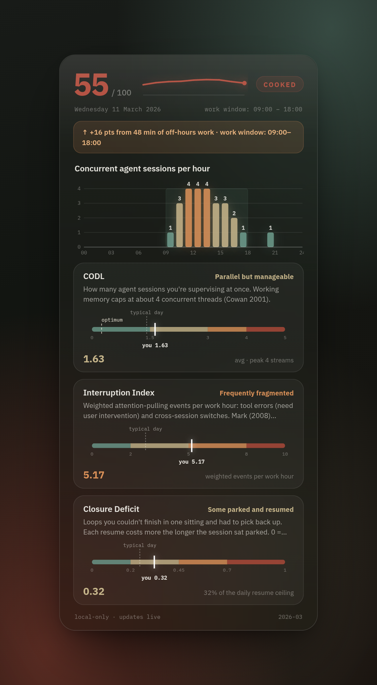

<p align="center">
  
</p>

<p align="center">
  <a href="paper/ai-code-cognitive-stress-paper.pdf">Read the paper</a> ·
  Private — nothing leaves your machine ·
  Pure stdlib, Python ≥ 3.10 ·
  <a href="LICENSE">MIT</a>
</p>

Running several LLM coding tools at once — or many sessions of one — puts you
in a role humans rarely held before: one operator supervising multiple
semi-autonomous agents at machine pace, switching between them all day and
judging their output in parallel. That load is real, it accumulates, and it
stays invisible until it isn't. `ai-code-cognitive-stress` turns the session
logs you already generate into an honest, research-grounded picture of that
load — scored against **your own** baseline, computed **entirely on your
machine**.

<p align="center">
  
</p>

## Why

AI assistance doesn't remove cognitive effort — it **shifts it from writing to
verifying and supervising**, and that load is hard to feel from the inside:

> In one randomized trial, experienced developers were **slowed ~19% by AI
> tooling yet believed it had sped them up** — exactly the perception gap an
> honest, behavioural, after-the-fact picture is built to close.

The closest studied analogue to running many agents (supervising multiple
drones) shows performance collapsing non-linearly past a personal "fan-out"
limit *before* the operator feels overloaded. And burnout tracks load *without
recovery*, not load alone.

Productivity dashboards count output; this counts *cognitive cost* —
concurrency, interruption, and lack of closure — against your own healthy
range. The full argument and every citation are in the
[paper](paper/ai-code-cognitive-stress-paper.pdf).

## How it works

<p align="center">
  
</p>

The whole pipeline is private — no network, no telemetry, nothing leaves the
machine. It reads logs you already have, reduces them to three behavioural
axes plus a composite score, and positions today against *your* history and an
individually-derived optimum (an inverted-U "flow channel", not a fixed
ceiling).

## Installation

One command. Pure-stdlib Python ≥ 3.10, zero third-party dependencies,
**not published to a package index** — you run it straight from a clone:

```bash
git clone https://github.com/sagium/ai-code-cognitive-stress.git
cd ai-code-cognitive-stress && python install.py
```

That single command sets up everything:

1. the **chat skill** — so using it is just talking to your agent: ask *"show
   me my stress profile"* or *"how loaded was my week?"* and it generates the
   report, writes a focused read of your own data, and opens it in your
   browser;
2. the **`aicogstress` CLI** on your PATH (editable via `uv`/`pipx` if you
   have one, a small stdlib launcher otherwise);
3. the **live desktop widget** for your OS — KDE Plasma 6 on Linux,
   [Übersicht](https://tracesof.net/uebersicht/) on macOS;
4. the **first computation** — your session logs are ingested and today's
   card rendered, so the widget and report open with data already in place.

Anything missing (Plasma's QtWebEngine QML module, the Übersicht app, …) is
detected and reported with the exact install command for your distro/OS —
install it and re-run `python install.py` (every step is idempotent). Remove
everything again with `python install.py --uninstall`.

Want less? `--skill-only` registers just the chat skill; `--plasmoid` /
`--ubersicht` (re)install just the widget.

### CLI usage

```bash
aicogstress --year 2026 --open    # or: python -m stress_levels --year 2026 --open
```

No install at all — **with [uv](https://docs.astral.sh/uv/)** (auto-provisions
a Python in range if you don't already have one):

```bash
uv run python -m stress_levels --year 2026 --open        # run from the working tree
uvx --from . ai-code-cognitive-stress --month 2026-05    # build + run the console app
```

Each run writes a self-contained HTML report (default `~/stress-profile.html`)
plus a `.json` sibling — structured data for the chat skill or any other
analysis layer. The flags you'll actually use (`--help` has the rest):

| Flag | What it does |
|---|---|
| `--year YYYY` / `--month YYYY-MM` / `--day YYYY-MM-DD` | report span (default: current month) |
| `--source <name>` | which coding tool's logs to ingest — repeatable, or `auto` for every tool found on disk (`--help` lists the built-in names) |
| `-o <path>` · `--open` | output path · open the report in your browser |
| `--emit-json` / `--emit-html-card` | print today's daily view as JSON / as the widgets' HTML card |
| `--rebuild-cache` | nuke the on-disk cache and recompute from raw logs |
| `--export-research` | write an anonymized year for the calibration study ([see below](#help-calibrate-the-index-optional-anonymous)) |

The per-day aggregate cache lives at
`${XDG_CACHE_HOME:-~/.cache}/ai-code-cognitive-stress/`. Metrics are always
recomputed from it, so algorithm changes apply on every run; `--rebuild-cache`
is only needed after the ingest/aggregate layer changes or to force a clean
rebuild.

### Live desktop widgets (KDE Plasma 6 · macOS)

A desktop widget that tracks **today** live: a compact header — the composite
**/ 100**, a one-word read on the level (*Chill* / *Heating up* / *Cooked*),
and an intraday score-progression sparkline — above the full daily view: the
per-hour concurrency chart and the three axis tiles with zone range bars.

<p align="center">
  
</p>

The card is rendered once, in Python (`stress_levels/widget_card.py`): both
widgets run `aicogstress --emit-html-card` on a timer and inject the
self-contained HTML it prints verbatim — they are thin hosts, pixel-identical
on both OSes, and can't drift. Private, no network. Only today is recomputed
each tick (past days are cached).

**KDE Plasma 6** — installed by `python install.py` (`--plasmoid` reinstalls
just it; `--uninstall --plasmoid` removes it). On the desktop it shows the
full card inline; in a panel, a compact score that expands on click. Plasma 6
/ Qt 6 only; the installer checks for the QtWebEngine QML module it needs and
prints your distro's install command if it's missing. After updating, restart
plasmashell (`kquitapp6 plasmashell && kstart plasmashell`).

**macOS** — an [Übersicht](https://tracesof.net/uebersicht/) widget (pictured
above), installed by `python install.py` when Übersicht is present
(`brew install --cask ubersicht` first). `--uninstall --ubersicht` removes it.
Not on a Mac? `desktop/ubersicht/preview.html` shows the widgets' exact card
in any browser — handy for hacking on it from Linux.

**Score stays blank?** `aicogstress` isn't on the widget's PATH (desktop
shells often don't inherit yours) — set the absolute path in the Plasma
widget's settings, or in the JSX file's `command` line on macOS.

## The metrics

Three behavioural axes are computed inside a **work window inferred per
operator** — the p10–p90 band of the hours *you* actually message your agents,
floored/ceiled outward to whole hours and applied as one stable band to every
date. There's no privileged weekend: work is whatever falls inside *your* own
hours on *any* date. Before 5 distinct days of data accrue (or if you pin a
window in `stress_levels/config.json`) a conventional 09:00–19:00 band serves
as a cold-start default.

<p align="center">
  
</p>

| Axis | What it measures | Grounded in |
|---|---|---|
| **CODL** (Concurrent Operational Demand Load) | How many agent sessions you supervise at once — engagement-weighted, so a session "cooking" in the background counts less than one you're actively driving | Working memory ≈ 4 chunks (**Cowan 2001**); non-linear degradation past fan-out limits (**Cummings & Mitchell 2008**; **Sheridan 1992**); monitoring cost of an out-of-the-loop supervisory role (**Warm et al. 2008**) |
| **Interruption Index** | Weighted attention-pulls per work hour — tool failures and cross-session switches, not ordinary tool calls | Interrupted work is faster but more stressful (**Mark, Gudith & Klocke 2008**); external switches cost ~25% more (**Mark, Gonzalez & Harris 2005**); attention residue (**Leroy 2009**); cross-tool switches cost more (**Wickens 2008**) |
| **Closure Deficit** | Loops you couldn't finish in one sitting and had to pick back up — scored by how long they sat parked (0 = everything closed in one sitting, 1 = many cold reloads) | Resumption cost rises with gap **duration** (**Monk, Trafton & Boehm-Davis 2008**); goal-activation decay (**Altmann & Trafton 2002**); context-reconstruction tax for interrupted coding (**Parnin & Rugaber 2011**); closure as a recovery resource (**Sonnentag & Fritz 2007**) |

<details>
<summary><strong>How each axis is computed</strong> (formulas and thresholds)</summary>

- **CODL** — 1-minute samples over the work window. A session counts at full
  weight (1.0) only while you're actively driving it — within a 5-minute grace
  of one of *your* messages; otherwise it's alive-but-background and counts at
  0.25. `codl_avg` is the time-weighted mean, `codl_peak` the max; the status
  threshold sits at the working-memory cap (~4).
- **Interruption Index** — `(tool_error × 1.5 + cross-session-start × 3.0) /
  work_hours`. Tool calls *within* a session don't count — that's a Waiting
  state, not an interruption.
- **Closure Deficit** — `min(1, Σ severity / 4)`. A **resume** is a true-idle
  gap in a session (no user *or* agent event) of ≥ 30 min whose pickup lands
  in the work window, or a same-session pickup on a later day. Each resume's
  **severity** is `min(1, gap ÷ 120 min)` — cost rises with how long the loop
  was parked, then saturates once context is fully cold. The daily ceiling
  (~4 cold reloads) is a loose Cowan anchor. A long *autonomous agent* turn is
  **not** counted (it isn't idle). Scored on **every** active day; `None` only
  on a day with no activity. Thresholds live in `config.json`
  (`resumption` and `codl` blocks).

</details>

**Composite (0–100)** is the equal-weighted blend of the three normalised
axes — the explicit v1 null hypothesis (no evidence yet favours one axis),
stated as such in the report's methodology footer. Sustained **off-hours
engagement** — interaction past the end of your inferred window, or
outlier-early (more than 3 h before its start; an ordinary early start is
free), not background sessions running while you're away — adds up to 30
points on top, saturating at 90 engaged minutes: disengagement from work is a
recovery resource, and off-hours work drains it.

**Personal optimum** is the CODL band where you historically closed the most
work with the least off-hours follow-up — your individual *flow channel*
(performance follows an inverted-U with load), marked on the charts as a
target, not a ceiling. It needs ~14 active workdays to stabilise; below that
the report shows `calibrating`.

**Recovery & off-hours.** Days that never reach low load, and work that spills
past your inferred hours, are flagged — because chronic load *without
recovery*, not peaks, is what damages you over time.

### Honest about what it can't tell you

- It measures **taskload** (objective demand from session events), not
  **workload** (felt experience). The validated subjective instrument is
  NASA-TLX (**Hart & Staveland 1988**); objective↔subjective correlation is
  moderate (r ≈ 0.4–0.6). A calm composite doesn't prove you feel calm.
- It is **not a clinical assessment.** For diagnosed burnout the validated
  instrument is the Maslach Burnout Inventory (**Maslach & Jackson 1981**).
  This is a self-run triage signal, not a diagnosis.
- The supervisory-control analogy is borrowed from UAV operators
  (**Crandall & Cummings 2007**) and is plausible but **unvalidated** for LLM
  oversight.
- The Closure Deficit's gap duration is a **proxy** for how cold a loop went,
  not a certainty: a long autonomous agent turn is excluded (it isn't idle),
  but stepping away mid-turn is not. The supporting lab evidence (**Monk et
  al. 2008**; **Altmann & Trafton 2002**) measured *short* (sub-minute)
  interruptions; multi-hour and cross-day gaps extrapolate beyond that regime,
  with **Parnin & Rugaber 2011** the closest in-domain field bridge.

Every threshold, weight, and recommendation traces to an entry in
[`stress_levels/citations.yml`](stress_levels/citations.yml) — the report
renders each citation at the point the number appears, never as a bare figure.
The full bibliography lives in the
[paper](paper/ai-code-cognitive-stress-paper.pdf).

## Help calibrate the index (optional, anonymous)

Today the index is honest but *borrowed* and *single-subject*: its thresholds
come from adjacent fields and have never been fitted to agent-coding
developers, and its three axes are weighted *equally* as an explicit null
hypothesis, not a measured fact. A modest multi-developer sample is what lets
those thresholds and weights be checked, refit, and validated — turning a
*principled* instrument into a *validated* one. The paper's validation
roadmap (§7) details exactly what pooled data unlocks.

You can help by donating **one anonymized year** of your own metrics — the
project's single, deliberate, **opt-in** sharing path. The tool never makes a
network call: it writes a local file, shows you a consent statement, and *you*
choose to upload it. Two steps, entirely under your control:

```bash
aicogstress --export-research --year 2026     # writes ./stress-levels-research-2026.json
# then upload that file at: https://tally.so/r/EkMM4q
```

What's in the file:

- **derived daily metrics** (the three axes + composite) and the **components
  behind them**, **per-session activity counts** (message/tool-call tallies
  and durations), an **hourly activity-load shape**, and your typical
  **working-hour ranges** — enough to debug the metrics and ingestion;
- calendar **dates randomly shifted** and a **random per-export id** — so the
  data isn't tied to you or a real calendar;
- **no** source code, file paths, repo or branch names, commit messages,
  session text, usernames, or timezone.

Open the JSON first if you'd like to see exactly what you'd send. Because the
upload is anonymous it can't be traced back and withdrawn afterwards, so it's
entirely your call. (Tally logs submitter IPs at the platform level; the *file
contents* carry no identity.)

<details>
<summary><strong>Calibrating from collected exports</strong> (maintainer)</summary>

Once a batch of exports has been collected, pool them and crunch the
population to recalibrate the index so it covers the real range of work
patterns:

```bash
aicogstress --calibrate ./exports --calibrate-out ./calibration-report.json
```

This reads the export files (a directory or a list of files — local files in,
local report out, no network), and suggests population-fitted **normalization
ceilings** and redundancy-informed **composite weights**, plus a
**work-pattern coverage map** and population reference percentiles. It prints
a ready-to-paste `scoring` block but changes nothing on its own — review it,
then opt in by setting the `scoring` block in `config.json` (`codl_ceiling`,
`interruption_ceiling`, `weights`; defaults are the current literature
values). Because the exports carry no felt-load labels, the calibration is
**unsupervised**: it fits scales and suggests weights from axis redundancy,
but does **not** validate weights against felt load — that needs a subjective
criterion (NASA-TLX / EMA) and stays future work.

</details>

## Extending

Adding a new coding tool is a single file: implement the `SessionSource`
protocol in [`stress_levels/sources/base.py`](stress_levels/sources/base.py)
(yield typed events from wherever that tool logs) and the rest of the
pipeline — aggregate, metrics, render, cache — is identical.

The project layout and the rules for working in this repo live in
[`AGENTS.md`](AGENTS.md) — the tool-agnostic instructions file that agent
coding tools read.

## License

[MIT](LICENSE) © 2026 Marinos Prevenios.
