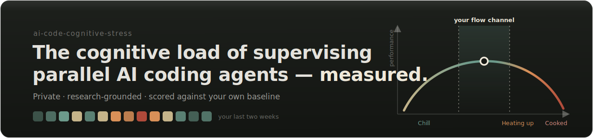
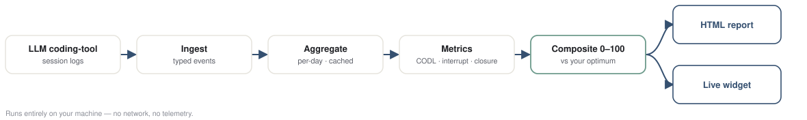
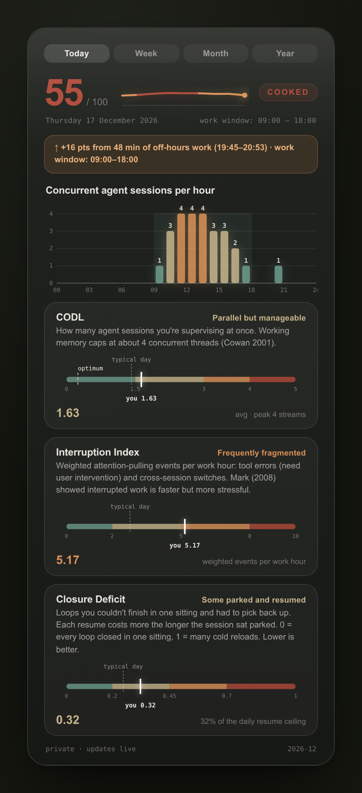
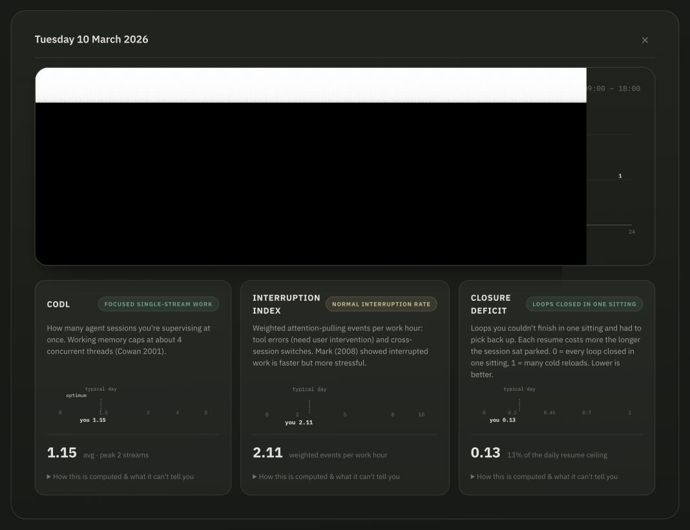

<p align="center">
  
</p>

<a href="paper/ai-code-cognitive-stress-paper.pdf">Read the paper</a> explaining the research behind this.

Running several LLM coding tools at once — or many sessions of one — puts you
in a role humans rarely held before: one operator supervising multiple
semi-autonomous agents at machine pace, switching between them all day and
judging their output in parallel.

That load is real, it accumulates, and it
stays invisible until it isn't. 

This tool turns the session
logs you already generate into an honest, research-grounded picture of that
load — scored against **your own** baseline.

<p align="center">
  
</p>

## Why

AI assistance doesn't remove cognitive effort — it **shifts it from writing to
verifying and supervising**, and that load is hard to feel from the inside:

> In one randomized trial, experienced developers were **slowed ~19% by AI
> tooling yet believed it had sped them up** — exactly the perception gap an
> honest, behavioural, after-the-fact picture is built to close.

The closest studied analogue to running many agents (supervising multiple
drones) shows performance collapsing non-linearly past a personal "fan-out"
limit *before* the operator feels overloaded. And burnout tracks load *without
recovery*, not load alone.

Productivity dashboards count output; this counts *cognitive cost* —
concurrency, interruption, and lack of closure — against your own healthy
range. The full argument and every citation are in the
[paper](paper/ai-code-cognitive-stress-paper.pdf).

## How it works

<p align="center">
  
</p>

The whole pipeline is private — no network, no telemetry, nothing leaves the
machine. It reads logs you already have, reduces them to three behavioural
axes plus a composite score, and positions today against *your* history and an
individually-derived optimum (an inverted-U "flow channel", not a fixed
ceiling).

## Installation

One command. Pure-stdlib Python ≥ 3.10, zero third-party dependencies,
**not published to a package index** — you run it straight from a clone:

```bash
git clone https://github.com/sagium/ai-code-cognitive-stress.git
cd ai-code-cognitive-stress && python install.py
```

That single command sets up everything:

1. the **chat skill** — so using it is just talking to your agent: ask *"show
   me my stress profile"* or *"how loaded was my week?"* and it generates the
   report, writes a focused read of your own data, and opens it in your
   browser;
2. the **`aicogstress` CLI** on your PATH (editable via `uv`/`pipx` if you
   have one, a small stdlib launcher otherwise);
3. the **live desktop widget** for your OS — KDE Plasma 6 on Linux,
   [Übersicht](https://tracesof.net/uebersicht/) on macOS;
4. the **first computation** — your session logs are ingested and today's
   card rendered, so the widget and report open with data already in place.

### CLI usage

```bash
aicogstress --help
aicogstress --year 2026 --open    # or: python -m stress_levels --year 2026 --open
```

No install at all — **with [uv](https://docs.astral.sh/uv/)** (auto-provisions
a Python in range if you don't already have one):

```bash
uv run python -m stress_levels --year 2026 --open        # run from the working tree
uvx --from . ai-code-cognitive-stress --month 2026-05    # build + run the console app
```

### Live desktop widgets (KDE Plasma 6 · macOS)

A desktop widget is available for keep you honest and up to date



## The metrics

Three behavioural axes are computed inside a **work window inferred per
operator** — the p10–p90 band of the hours *you* actually message your agents,
floored/ceiled outward to whole hours and applied as one stable band to every
date. There's no privileged weekend: work is whatever falls inside *your* own
hours on *any* date. Before 5 distinct days of data accrue (or if you pin a
window in `stress_levels/config.json`) a conventional 09:00–19:00 band serves
as a cold-start default.

<p align="center">
  
</p>

| Axis | What it measures | Grounded in |
|---|---|---|
| **CODL** (Concurrent Operational Demand Load) | How many agent sessions you supervise at once — engagement-weighted, so a session "cooking" in the background counts less than one you're actively driving | Working memory ≈ 4 chunks (**Cowan 2001**); non-linear degradation past fan-out limits (**Cummings & Mitchell 2008**; **Sheridan 1992**); monitoring cost of an out-of-the-loop supervisory role (**Warm et al. 2008**) |
| **Interruption Index** | Weighted attention-pulls per work hour — tool failures and cross-session switches, not ordinary tool calls | Interrupted work is faster but more stressful (**Mark, Gudith & Klocke 2008**); external switches cost ~25% more (**Mark, Gonzalez & Harris 2005**); attention residue (**Leroy 2009**); cross-tool switches cost more (**Wickens 2008**) |
| **Closure Deficit** | Loops you couldn't finish in one sitting and had to pick back up — scored by how long they sat parked (0 = everything closed in one sitting, 1 = many cold reloads) | Resumption cost rises with gap **duration** (**Monk, Trafton & Boehm-Davis 2008**); goal-activation decay (**Altmann & Trafton 2002**); context-reconstruction tax for interrupted coding (**Parnin & Rugaber 2011**); closure as a recovery resource (**Sonnentag & Fritz 2007**) |

Every threshold, weight, and recommendation traces to an entry in
[`stress_levels/citations.yml`](stress_levels/citations.yml) — the report
renders each citation at the point the number appears, never as a bare figure.

The full bibliography lives in the
[paper](paper/ai-code-cognitive-stress-paper.pdf).

## Help us calibrate the index

Today the index is honest but *borrowed*: its thresholds
come from adjacent fields and have never been fitted to agent-coding
developers, and its three axes are weighted *equally* as an explicit null
hypothesis, not a measured fact. A modest multi-developer sample is what lets
those thresholds and weights be checked, refit, and validated.

You can help by contributing **one anonymized year** of your own metrics

```bash
aicogstress --export-research --year 2026     # writes ./stress-levels-research-2026.json
# then upload that file at: https://tally.so/r/EkMM4q
```

Open the JSON first if you'd like to see exactly what you'd send.

Because the upload is anonymous it can't be traced back and withdrawn afterwards. (Tally logs submitter IPs at the platform level; the *file
contents* carry no identity.)

## Extending

Feel free to hack it for your own benefit or open a PR

## License

[MIT](LICENSE) © 2026 Marinos Prevenios.
