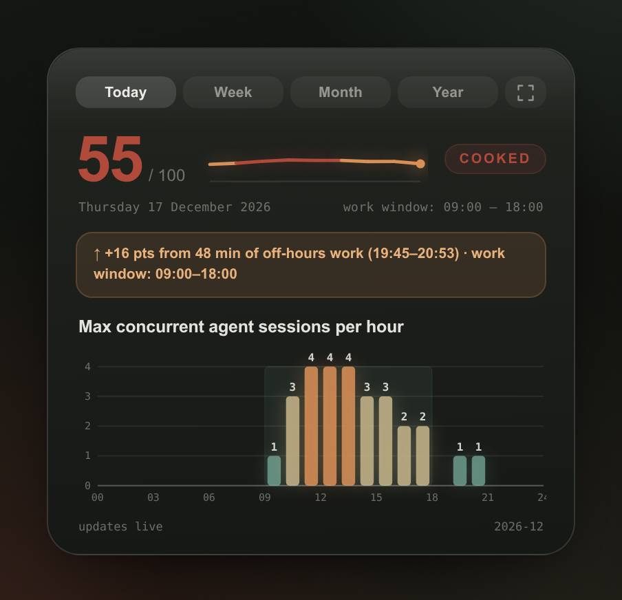

<p align="center">
  
</p>

<p align="center">
  <b>See the supervision load behind your AI-assisted development workflow.</b><br>
  Local only. Personalized to your history. Zero runtime dependencies.
</p>

<p align="center">
  <a href="paper/ai-code-cognitive-stress-paper.pdf"><b>Read the research paper</b></a>
</p>

---

**ai-code-cognitive-stress** turns local Claude Code and OpenAI Codex CLI
session logs into an interactive report of the load involved in supervising AI
coding agents. It tracks three behavioral signals: concurrent sessions,
attention interruptions, and unfinished loops that must be resumed later.

The result is a private, longitudinal view of your working patterns, scored
against your own baseline rather than a universal productivity target. Use it
to identify periods where more agent activity may be producing less effective
supervision.

This is a task-load indicator, not a medical or clinical assessment. Its
thresholds come from adjacent research on working memory, interruption, human
supervisory control, and recovery; they have not yet been validated on a broad
population of agent-coding developers. The report keeps that limitation
visible alongside its recommendations.

<p align="center">
  
</p>

## Quickstart

```bash
git clone https://github.com/sagium/ai-code-cognitive-stress.git
cd ai-code-cognitive-stress
python3 install.py
aicogstress --open
```

On Windows, use `py install.py` for the installer command.

The final command generates the current month's report at
`~/stress-profile.html`, writes a machine-readable JSON sibling, and opens the
HTML in your browser.

`install.py` is idempotent. It registers the chat skills, installs the
`aicogstress` CLI, attempts to configure the desktop widget for your platform,
and primes the local cache. Missing optional widget prerequisites are reported
without blocking the rest of the installation.

Prefer a chat interface? After installation, ask Claude Code or Codex CLI:

> Show me my stress profile.

Requirements: **Python 3.10 or newer**. The analysis and report runtime uses
only the Python standard library. Linux, macOS, and Windows are supported.

## What you get

- A self-contained HTML report with daily, monthly, and yearly views.
- A JSON file beside every report for scripts and other integrations.
- A live desktop card with today, week, month, and year tabs.
- A durable local archive that preserves completed-day metrics after source
  tools rotate their session logs.
- Recommendations linked to the literature and the assumptions behind them.

## How it works

<p align="center">
  
</p>

The pipeline is shared by the report, CLI integrations, and desktop widgets:

1. Adapters parse supported local session logs into a common event model.
2. Events are aggregated by day and cached using source modification times.
3. The metric layer derives concurrency, interruption, and closure signals.
4. Scores are positioned against your rolling history and estimated personal
   optimum.
5. The renderer writes self-contained HTML and JSON output to local disk.

### Metrics

Metrics are computed inside a work window inferred from the hours when you
actually interact with agents. Once five distinct days are available, the
window uses the p10-p90 band of your activity, rounded outward to whole hours.
Until then, the default is 09:00-19:00. You can pin a window in
`ai_code_cognitive_stress/core/config.json`.

| Axis | What it measures | Research basis |
|---|---|---|
| **CODL** (Concurrent Operational Demand Load) | Engagement-weighted agent sessions under supervision. Background work counts less than a session you are actively driving. | Working-memory capacity (Cowan 2001), fan-out limits (Cummings & Mitchell 2008; Sheridan 1992), and out-of-the-loop monitoring costs (Warm et al. 2008). |
| **Interruption Index** | Attention pulls per work hour, weighted toward failures and cross-session or cross-tool switches rather than ordinary tool calls. | Interruption stress and switching cost (Mark, Gudith & Klocke 2008; Mark, Gonzalez & Harris 2005), attention residue (Leroy 2009), and multiple-resource interference (Wickens 2008). |
| **Closure Deficit** | Work loops resumed in a later sitting, weighted by how long they remained parked. Zero means every observed loop closed in one sitting. | Resumption lag (Monk, Trafton & Boehm-Davis 2008), goal-activation decay (Altmann & Trafton 2002), context reconstruction (Parnin & Rugaber 2011), and recovery (Sonnentag & Fritz 2007). |

Every threshold, weight, and recommendation maps to
[`ai_code_cognitive_stress/core/citations.yml`](ai_code_cognitive_stress/core/citations.yml).
The report presents citations where the corresponding values appear; the full
method and bibliography are in
[*In Search of Sustainable Pace in Agentic Coding and Orchestration*](paper/ai-code-cognitive-stress-paper.pdf).

<p align="center">
  
</p>

## Why measure supervision load?

AI assistance shifts part of development from writing code to dispatching,
reviewing, correcting, and coordinating generated work. Agent throughput can
scale faster than human attention, especially when several sessions run at
once. Conventional dashboards count output or token use; they do not show the
cost of maintaining careful supervision.

Research in adjacent domains suggests that this cost is easy to misjudge. In a
randomized trial cited by the paper, experienced developers using AI tools were
about 19% slower while believing they were faster. Studies of multi-vehicle
supervision also report nonlinear performance loss beyond an operator's
fan-out limit. These findings do not directly validate this index, but they
motivate making otherwise invisible work patterns inspectable.

For an individual, that can reveal sustained overload, fragmented attention,
or too many cold resumptions. For a team, it provides a vocabulary for
discussing review capacity and recovery without treating maximum agent output
as the only objective.

## Supported tools and platforms

### Input adapters

| Tool | Local data source |
|---|---|
| **Claude Code** | `~/.claude/projects/**` session transcripts |
| **OpenAI Codex CLI** | `~/.codex/sessions/**` session logs |

With the default `--source auto`, every detected source is included. Use a
repeatable `--source` flag to select inputs explicitly.

### Desktop output

| Platform | Widget host |
|---|---|
| Linux / KDE | KDE Plasma 6 |
| Linux / GNOME, XFCE, Cinnamon, MATE, or Budgie | GTK3 + WebKit2GTK |
| macOS | [Übersicht](https://tracesof.net/uebersicht/) |
| Windows | WebView2 |

The CLI and HTML report require only Python. Desktop hosts have platform
dependencies; `install.py` detects them and prints the relevant setup command
when one is missing.

## CLI usage

```bash
aicogstress --open                         # current month
aicogstress --day 2026-06-21 --open        # one day
aicogstress --month 2026-06 --open         # one month
aicogstress --year 2026 --open             # one year
aicogstress --source codex --open          # one source only
aicogstress --emit-json                     # today's canonical view as JSON
aicogstress --help
```

The module entry point is equivalent:

```bash
python3 -m ai_code_cognitive_stress --open
```

On Windows, use `py -m ai_code_cognitive_stress --open`.

### Run from the working tree with uv

[`uv`](https://docs.astral.sh/uv/) can provision a compatible Python when one
is not already installed:

```bash
uv run python -m ai_code_cognitive_stress --open
uvx --from . ai-code-cognitive-stress --month 2026-06
```

### Desktop card

The widget uses the same renderer on every platform. Its full view shows the
composite score, concurrency chart, and all three metrics. Compact mode keeps
only the headline and concurrency chart:

```bash
aicogstress --set-compact true
aicogstress --set-compact false
```

<p>
  
  
</p>

## Data and privacy

The analyzer reads local session logs and writes local HTML, JSON, cache, and
archive files. **Analysis and reporting make no network requests:** there is no
telemetry, remote rendering, or automatic data collection. Session content can
still be sensitive, so treat generated reports as you would the source logs.

Some coding tools delete, compact, or archive older sessions. To preserve the
derived history, completed-day statistics are stored in the platform data
directory. On Linux, that is
`${XDG_DATA_HOME:-~/.local/share}/ai-code-cognitive-stress/`. The archive is
separate from the disposable cache and survives `--rebuild-cache`.

`--reset-archive` permanently removes archived history whose original logs may
no longer exist. Use it only when you intentionally want to start over.

## Research calibration

The default thresholds are borrowed from adjacent fields, and the three axes
currently have equal weight as an explicit null hypothesis. Community data can
help test and calibrate those choices.

To contribute, generate one anonymized year locally:

```bash
aicogstress --export-research --year 2026
```

The command writes `./stress-levels-research-2026.json` after displaying a
consent prompt. It does not upload anything. The export excludes code, paths,
repository names, usernames, and time zones; dates are randomly shifted. Read
the file before manually uploading it at <https://tally.so/r/EkMM4q>.

Anonymous submissions cannot be traced back for later withdrawal. Tally may
log submitter IP addresses at the platform level, but the exported file itself
contains no identity fields.

## Development

Create an isolated environment and install the test dependencies:

```bash
python3 -m venv .venv
source .venv/bin/activate
python -m pip install -e ".[test]"
pytest --cov --cov-report=term-missing
```

On Windows PowerShell, create the environment with `py -m venv .venv` and
activate it with `.\.venv\Scripts\Activate.ps1`.

The runtime package is standard-library only. Tests use synthetic fixtures and
do not read your real session history.

The main extension point is the `SessionSource` protocol in
[`ai_code_cognitive_stress/adapters/base.py`](ai_code_cognitive_stress/adapters/base.py).
To add a coding tool, implement the protocol in a new adapter module, register
it with source discovery and the CLI source resolver, and add hermetic adapter
tests. Aggregation, metrics, caching, serialization, and rendering remain
shared across all sources.

Contributions are welcome through pull requests.

## License

[MIT](LICENSE) (c) 2026 Marinos Prevenios.
